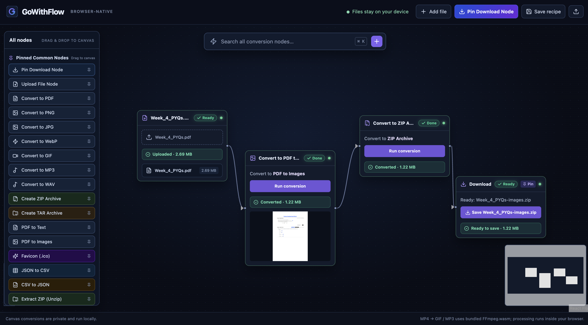
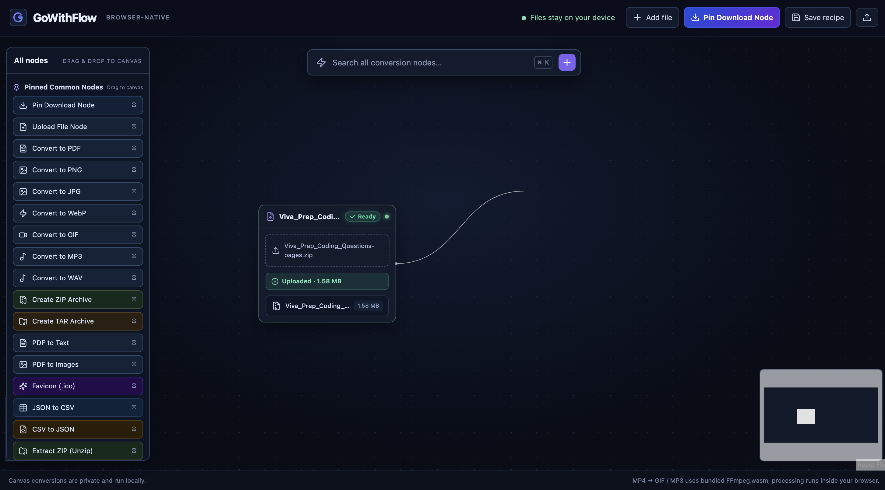
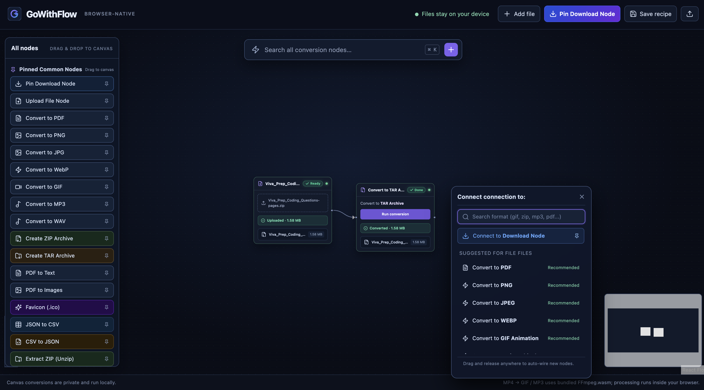
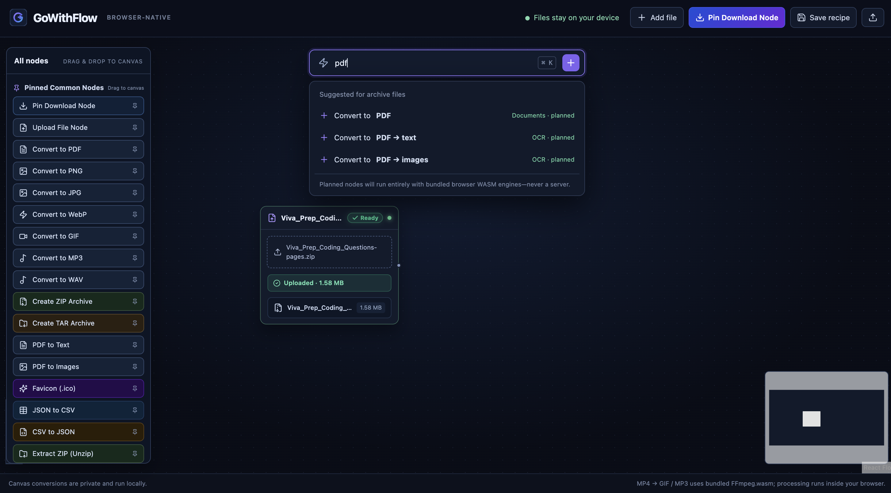
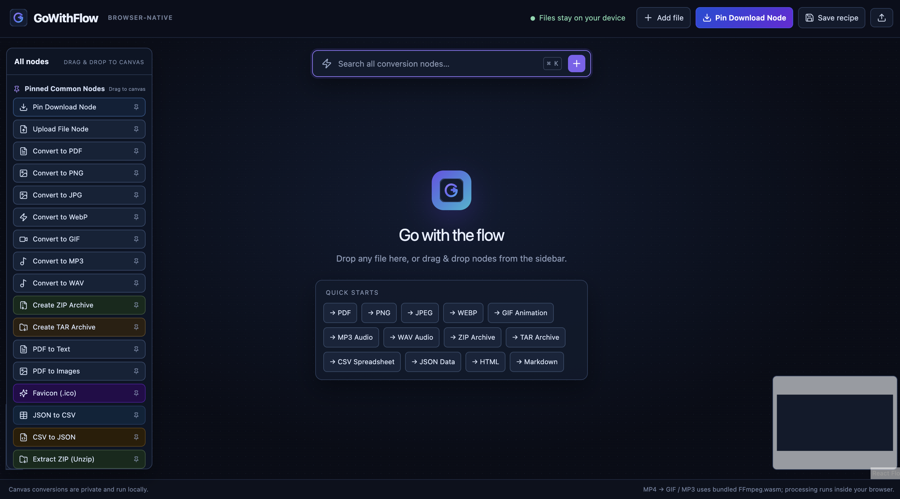
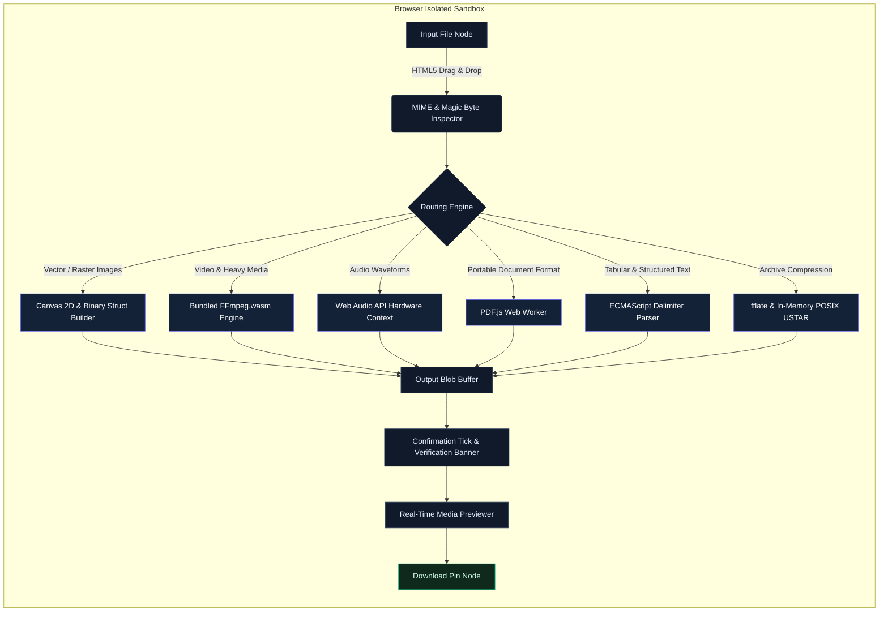

<p align="center">
  
</p>

# GoWithFlow

```
   ____      _      ___ _   _     _____ _     _____        __
  / ___|___ | | /\ / (_) |_| |__ |  ___| |   / _ \ \      / /
 | |  _/ _ \| |/  \| | | __| '_ \| |_  | |  | | | \ \ /\ / / 
 | |_| (_)  | | /\ \ | | |_| | | |  _| | |__| |_| |\ V  V /  
  \____\___/|_|/  \/_|_|\__|_| |_|_|   |_____\___/  \_/\_/   
```

**Zero-Upload, Browser-Native Visual File Conversion Studio**

<p align="left">
  <a href="https://www.typescriptlang.org/"></a>
  <a href="https://react.dev/"></a>
  <a href="https://reactflow.dev/"></a>
  <a href="https://ffmpegwasm.netlify.app/"></a>
  
  
  
  
</p>

---

## Visual Demonstration

<p align="center">
  
</p>

---

## Executive Overview

GoWithFlow is a client-side, visual node-graph application for file conversion, media transcoding, document extraction, and archive compilation.

Every standard online file converter requires transmitting proprietary files, contracts, tax PDFs, credentials, videos, and private images across public networks to untrusted remote cloud clusters. GoWithFlow replaces remote backend servers with WebAssembly, Web Audio API, Canvas 2D, and native browser memory.

All data parsing, pixel manipulation, audio re-encoding, video transcoding, and compression routines execute inside your local browser sandbox. Once cached, the application functions in completely air-gapped environments without sending a single byte over the wire.

---

## Key Highlights

- **Complete Data Sovereignty**: Files reside solely in client memory and are never uploaded to any remote server or third-party service.
- **Visual Graph Orchestration**: Chain multiple input files, format converters, and download pins together across an infinite canvas.
- **Context-Aware Smart Connections**: Dragging a connection line into empty space triggers an instant format picker filtered specifically to the source node's data type.
- **Real-Time Previews & Verification**: Completed conversions immediately present interactive previews (image thumbnails, audio waveforms, video players, and syntax-highlighted text snippets) alongside size verification badges.
- **Modular Pinned Library**: Drag-and-drop frequently needed nodes directly onto the canvas, including Favicon (.ico) generator, JSON-to-CSV, CSV-to-JSON, PDF-to-Images, and archive handlers.
- **Zero Configuration Recipes**: Save and restore complex conversion pipeline topologies as lightweight JSON schema files containing zero sensitive file data.

---

## Visual Interface Walkthrough

### 1. Interactive Multi-Node Pipeline
Build complex transformation trees where a single upload fans out to multiple formats simultaneously, or feeds sequential pipelines (e.g., Video -> Audio Extraction -> Compression).

<p align="center">
  
</p>

### 2. Contextual Wire Dragging & Fast Node Spawning
Drag an output handle into empty canvas space to summon an intelligent, auto-focused connection modal. Search across all formats or select from recommendations tailored to the parent file type.

<p align="center">
  
</p>

### 3. Smart Format Suggestions
Whenever a file is loaded, GoWithFlow inspects its MIME headers and file extension to present relevant compatible operations.

<p align="center">
  
</p>

### 4. Global Command Palette
Press `Cmd + K` (or `Ctrl + K`) to query all available and planned node types with fuzzy search and keyboard navigation.

<p align="center">
  
</p>

### 5. Clean Slate Starting Experience
Get started instantly with quick-start pipeline buttons, or drag common pinned nodes from the left-hand library.

<p align="center">
  
</p>

---

## System Architecture



---

## Supported Conversion Matrix

| Domain | Source Formats | Target Outputs | Processing Engine | Performance Profile |
| :--- | :--- | :--- | :--- | :--- |
| **Raster Images** | PNG, JPG, JPEG, WebP, AVIF, BMP, SVG | PNG, JPEG, WebP, BMP | HTML5 Canvas 2D | Sub-millisecond synchronous |
| **Icon Systems** | PNG, JPG, WebP, SVG | Windows Favicon (.ico) | Native Binary ICO Synthesizer | Direct memory byte buffer |
| **Monochrome** | PNG, JPG, WebP, BMP | Grayscale PNG | Rec. 601 Luma Transform | Hardware-accelerated canvas |
| **Video Transcoding** | MP4, WebM, MKV, AVI, MOV, FLV | Animated GIF, MP4 (H.264), WebM (VP9) | Bundled FFmpeg.wasm (SharedArrayBuffer) | Multi-core SIMD WASM |
| **Audio Extraction** | MP4, WebM, MKV, AVI, WAV, MP3 | MP3 (192kbps), WAV (PCM 16-bit) | Web Audio API + FFmpeg Audio Core | Native audio hardware graph |
| **PDF Extraction** | PDF Documents | Plain Text (.txt), Page Images (.zip) | PDF.js Worker + fflate | Multi-threaded page rendering |
| **Rich Documents** | Markdown, HTML, Plain Text | PDF, DOCX, HTML, Markdown, JSON | marked + turndown + docx + html2pdf | Pure client-side parsing |
| **Tabular Data** | JSON (Arrays / Objects), CSV | CSV (RFC 4180), Formatted JSON | Streaming Delimiter Tokenizer | Microsecond memory parsing |
| **Encoding** | Any Binary File | Data URI / Base64 Text (.txt) | Chunked Byte Stream Chunker | Linear O(N) single-pass |
| **Archive Creation** | Any Files / Assets | ZIP, TAR (POSIX ustar), GZ (RFC 1952) | fflate + Custom POSIX Synthesizer | Memory-mapped compression |
| **Archive Decompression**| ZIP Archives | Extracted Binaries / Manifest Report | Client-Side Inflation Engine | Direct buffer extraction |

---

## Architectural Comparison

| Attribute | Legacy Cloud Converters | GoWithFlow |
| :--- | :--- | :--- |
| **Data Privacy** | Files uploaded to remote databases | Files never leave client device memory |
| **Network Overhead** | Full upload + full download bandwidth | Zero bytes transferred over network |
| **Air-Gap Readiness** | Fails without active Internet access | Fully functional offline once loaded |
| **Latency** | Network latency + remote job queues | Real-time local execution |
| **Compliance** | Requires third-party vendor assessments | Inherently compliant: zero data transfer |
| **File Size Constraints**| Artificial limits to enforce paid tiers | Limited strictly by client device RAM |
| **Pipeline Support** | Single 1:1 conversion per form | Infinite multi-node branching DAGs |
| **Cost** | Recurring subscription or pay-per-conversion | Free open-source project |

---

## Engineering Deep Dives

### 1. In-Memory POSIX USTAR Synthesizer
GoWithFlow compiles TAR archives directly without third-party native dependencies:
- Generates 512-byte POSIX `ustar\0` header records conforming to IEEE Std 1003.1.
- Computes standard octal values for file mode bits (`0000644\0`), zeroed owner/group IDs, byte lengths, and header checksums.
- Automatically computes block padding to boundary alignments of 512 bytes followed by dual 512-byte null terminating blocks.

### 2. Emscripten Memory & SharedArrayBuffer Isolation
Modern browsers mandate `Cross-Origin-Opener-Policy: same-origin` and `Cross-Origin-Embedder-Policy: require-corp` headers to permit high-performance SharedArrayBuffer instances.
- FFmpeg.wasm virtual filesystem reads return views directly backed by shared WebAssembly linear memory.
- Creating native `Blob` instances directly over shared buffers triggers browser `TypeError` restrictions.
- GoWithFlow utilizes strict non-shared buffer extraction (`new Uint8Array(bytes).slice().buffer`) ensuring seamless, leak-free Blob creation.

### 3. Binary Favicon (.ico) Synthesizer
Rather than relying on server-side ImageMagick processes, GoWithFlow synthesizes binary Windows Icon structures directly:
- Writes a 6-byte `ICONDIR` header (Reserved: 0, Resource Type: 1, Image Count: 1).
- Formulates a 16-byte `ICONDIRENTRY` block specifying width (32px), height (32px), color count (0), color planes (1), bits-per-pixel (32-bit RGBA), image size, and data offset.
- Appends standard PNG image payloads, creating cross-browser compliant `.ico` files.

### 4. RFC 4180 Delimiter Streaming Parser
The tabular engine parses and serializes bidirectional CSV/JSON data:
- Handles escaped double-quotes (`""`), multi-line string cells, and arbitrary column boundaries without regular expression catastrophic backtracking.
- Automatically infers numerical, boolean, and string primitives during CSV-to-JSON transformations.

---

## Pipeline Recipes Specification

Pipelines can be saved and imported as JSON recipes. Recipes describe graph topology and node settings without embedding any file content:

```json
{
  "version": 1,
  "nodes": [
    {
      "id": "node-input-1",
      "position": { "x": 100, "y": 140 },
      "data": { "label": "Source_Presentation.pdf", "type": "input" }
    },
    {
      "id": "node-convert-1",
      "position": { "x": 420, "y": 140 },
      "data": { "label": "Convert to PDF to Images", "type": "convert", "target": "pdf-images" }
    },
    {
      "id": "node-output-1",
      "position": { "x": 740, "y": 140 },
      "data": { "label": "Download Archive", "type": "output" }
    }
  ],
  "edges": [
    { "id": "e1", "source": "node-input-1", "target": "node-convert-1" },
    { "id": "e2", "source": "node-convert-1", "target": "node-output-1" }
  ]
}
```

---

## Local Setup & Development

### Prerequisites
- Node.js 18.0.0 or higher
- npm 9.0.0 or higher

### Installation

Clone the repository and install all dependencies:

```bash
git clone https://github.com/GarvitOfficial/universalFile.git
cd universalFile
npm install
```

### Development Server

Start the local Vite server with cross-origin isolation headers enabled:

```bash
npm run dev
```

Open `http://localhost:5173` in your browser.

### Production Compilation

Validate type safety and compile optimized static distribution assets:

```bash
npm run build
```

Production artifacts are written to `dist/` and can be hosted on GitHub Pages, Cloudflare Pages, Vercel, Netlify, or any static HTTP file server.

---

## Standalone Automated Verification

GoWithFlow includes an automated verification script that executes conversion routines programmatically without browser UI dependencies:

```bash
node test_manual.mjs
```

### Verification Coverage:
- POSIX USTAR TAR generation and octal checksum validation.
- Deflate compression and multi-file ZIP archive extraction parity.
- RFC 1952 Gzip magic identification (`0x1F 0x8B`).
- RFC 4180 CSV escaping, column mapping, and newline preservation.
- Bidirectional CSV to JSON transformation and primitive type coercion.
- Windows Icon (.ico) binary header and directory alignment.
- Stream chunked Base64 text encoding.

---

## Repository Structure

```
.
├── assets/
│   ├── Search.png              # Command palette visual capture
│   ├── connecting.png          # Wire drag connection capture
│   ├── demo.png                # Production canvas overview
│   ├── starting.png            # Initial workspace interface
│   └── suggestion.png          # Format recommendation interface
├── public/
│   ├── favicon.svg             # Minimalist vector icon mark
│   ├── ffmpeg/                 # Static FFmpeg.wasm core and assets
│   ├── pdf.worker.min.mjs      # Dedicated PDF.js worker
│   └── standard_fonts/         # Metrics and font descriptors for PDF.js
├── src/
│   ├── App.tsx                 # Canvas state, graph lifecycle, UI components
│   ├── catalog.ts              # Capability definitions and format groupings
│   ├── converters.ts           # Pure-browser converter implementation layer
│   ├── main.tsx                # Application mounting entry point
│   ├── styles.css              # Theme tokens, custom cards, and layout styles
│   └── vite-env.d.ts           # Environment type definitions
├── index.html                  # HTML entry point with metadata and favicon
├── package.json                # Project dependencies and npm scripts
├── test_manual.mjs             # Standalone test runner
├── tsconfig.json               # TypeScript compiler options
└── vite.config.ts              # Vite configuration with COOP/COEP isolation headers
```
